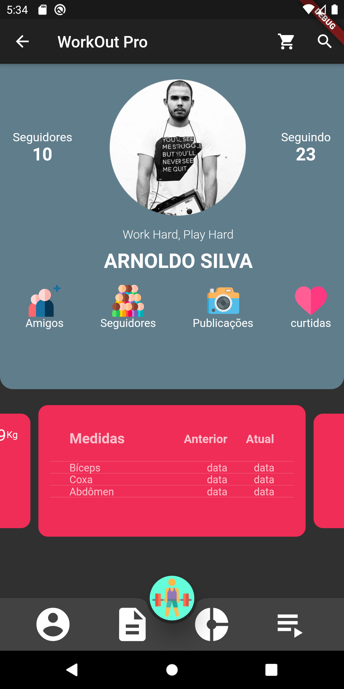

# academia_sport_mix

Este é um projeto de App que será implantando em testes na Academia SportMix. Tem como objetivo principal a integração das Apis do Spotify e MyFitnessPal. O usuário poderá acompanhar sua evolução por peso, exercício e comparar com seus amigos.

## Possui academia e tem interesse?

Deseja levar este App para sua academia?

<b>Arnoldo Silva</b> - [www.arnoldosilva.com.br](https://www.arnoldosilva.com.br)

## Créditos

Este App utiliza os seguintes pacotes ou assets de uso livre:

- [Flutter](https://flutter.dev/)
- [API Spotify](https://developer.spotify.com/dashboard/login)
- [API MyFitnessPal](https://www.myfitnesspal.com/pt/api)

## Suporte

Ajude este Desenvolvedor a continuar seu sonho em desenvolvimento de jogos e mobile! Doe pelo PayPal ou seja meu patrão no Patreon!

    
    

## Licença
Distribuído sob [MIT](https://github.com/arnoldosilva/vai_chover_hoje/blob/master/LICENSE) Licença. Leia mais em [LICENSE](https://github.com/arnoldosilva/vai_chover_hoje/blob/master/LICENSE)

---

## Contato

****